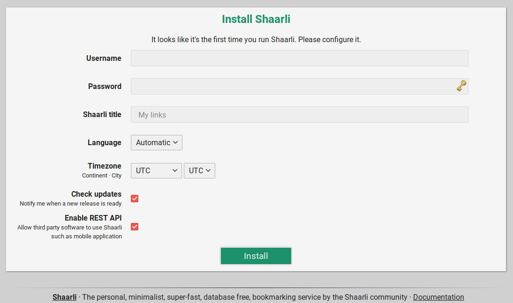

# Installation

## Requirements

**Hardware/Operating system:** Shaarli can be hosted on dedicated servers, or shared hosting. The smallest DigitalOcean VPS (Droplet with 1 CPU, 1 GiB RAM and 25 GiB SSD) costs about $5/month and will run any Shaarli installation without problems. Examples in this documentation are given for [Debian](https://www.debian.org/), a GNU/Linux distribution widely used in server environments. Please adapt them to your specific Linux distribution. You should have received instructions from your hosting provider on how to connect to the server using SSH (or FTP for shared hosts).

**Network:** A domain name (DNS record) pointing to the server's public IP address is required to obtain a SSL/TLS certificate and setup HTTPS to secure client traffic to your Shaarli instance. Try to host the server in a region that is geographically close to your users.

## From release ZIP

To install Shaarli, simply place the files from the latest [release .zip file](https://github.com/shaarli/Shaarli/releases) archive under your webserver's Document Root (directly at the document root, or in a subdirectory). Download our **shaarli-vX.X.X-full** archive to include dependencies.

```bash
$ wget https://github.com/shaarli/Shaarli/releases/download/v0.10.4/shaarli-v0.10.4-full.zip
$ unzip shaarli-v0.10.4-full.zip
$ mv Shaarli /var/www/shaarli.mydomain.org
```

Please make sure your server is properly [configured](Server-configuration.md).


## From git sources

These components are required to build Shaarli:

- Install [Composer](Unit-tests.md#install_composer) to manage third-party [PHP dependencies](3rd-party-libraries.md#composer).
- Install [yarn](https://yarnpkg.com/lang/en/docs/install/) to build the frontend dependencies.
- Install [python3-virtualenv](https://pypi.python.org/pypi/virtualenv) to build the local HTML documentation.

Clone the repository, either using:

- any [tagged release](https://github.com/shaarli/Shaarli/releases)
- `latest`: the latest [tagged release](https://github.com/shaarli/Shaarli/releases)
- `master`: development branch


```bash
# clone the branch/tag of your choice
$ git clone -b latest https://github.com/shaarli/Shaarli.git /path/to/Shaarli
# OR download/extract the zip: wget https://github.com/shaarli/Shaarli/archive/latest.zip
# enter the directory
$ cd /path/to/Shaarli
# install 3rd-party PHP dependencies
$ composer install --no-dev --prefer-dist
# build frontend static assets
$ make build_frontend
# build translations
$ make translate
# build HTML documentation
$ make htmldoc
# copy the resulting shaarli directory under your webserver's document root
$ mv /path/to/shaarli /var/www/shaarli.mydomain.org
```

Also, please make sure your server is properly [configured](Server-configuration.md).

## Using Docker

[See the documentation](Docker.md)


## Finish Installation

Once Shaarli is downloaded and files have been placed at the correct location, open this location your web browser.

Setup your Shaarli installation, and it's ready to use! Congratulations! Your Shaarli is now available at `https://shaarli.mydomain.org`.




## Upgrading Shaarli

See [Upgrade and Migration](Upgrade-and-migration)
